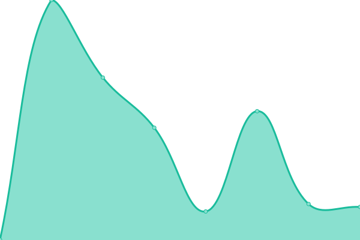
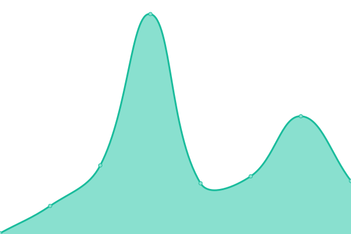
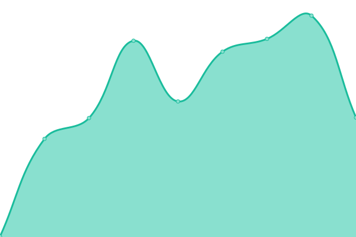
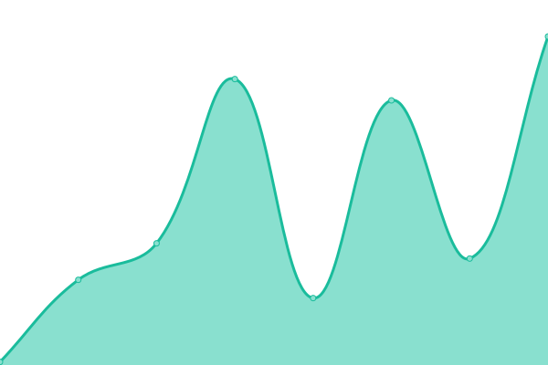
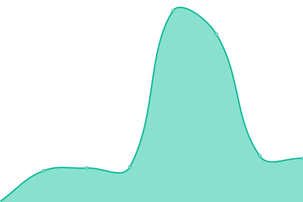

# [📈 Live Status](https://status.nya.one): <!--live status--> **🟩 All systems operational**

This repository contains the open-source uptime monitor and status page for [NyaOne 喵窝](https://nya.one), powered by [Upptime](https://github.com/upptime/upptime).

With [Upptime](https://upptime.js.org), you can get your own unlimited and free uptime monitor and status page, powered entirely by a GitHub repository. We use [Issues](https://github.com/nyaone/status/issues) as incident reports, [Actions](https://github.com/nyaone/status/actions) as uptime monitors, and [Pages](https://status.nya.one) for the status page.

<!--start: status pages-->
<!-- This summary is generated by Upptime (https://github.com/upptime/upptime) -->
<!-- Do not edit this manually, your changes will be overwritten -->
<!-- prettier-ignore -->
| URL | Status | History | Response Time | Uptime |
| --- | ------ | ------- | ------------- | ------ |
|  [Misskey](https://nya.one) | 🟩 Up | [misskey.yml](https://github.com/nyaone/status/commits/HEAD/history/misskey.yml) | 

 296ms
     
 | 

<a href="https://status.nya.one/history/misskey">100.00%</a>
    

|  [Server Stats](https://stats.nya.one) | 🟩 Up | [server-stats.yml](https://github.com/nyaone/status/commits/HEAD/history/server-stats.yml) | 

 332ms
     
 | 

<a href="https://status.nya.one/history/server-stats">100.00%</a>
    

|  [Static Files](https://file.nya.one/files/b116f00c-107e-4929-8b39-3fc2e9b8e5a2) | 🟩 Up | [static-files.yml](https://github.com/nyaone/status/commits/HEAD/history/static-files.yml) | 

 79ms
     
 | 

<a href="https://status.nya.one/history/static-files">100.00%</a>
    

|  [CN Optimize](https://m.nya.one) | 🟩 Up | [cn-optimize.yml](https://github.com/nyaone/status/commits/HEAD/history/cn-optimize.yml) | 

 427ms
     
 | 

<a href="https://status.nya.one/history/cn-optimize">100.00%</a>
    

|  [Matrix](https://nya.one/_matrix/client/versions) | 🟩 Up | [matrix.yml](https://github.com/nyaone/status/commits/HEAD/history/matrix.yml) | 

 85ms
     
 | 

<a href="https://status.nya.one/history/matrix">100.00%</a>
    

|  [Fediverse Relay](https://relay.nya.one/stats) | 🟩 Up | [fediverse-relay.yml](https://github.com/nyaone/status/commits/HEAD/history/fediverse-relay.yml) | 

 283ms
     
 | 

<a href="https://status.nya.one/history/fediverse-relay">100.00%</a>
    

<!--end: status pages-->

[**Visit our status website →**](https://status.nya.one)

## 📄 License

- Powered by: [Upptime](https://github.com/upptime/upptime)
- Code: [MIT](./LICENSE) © [NyaOne 喵窝](https://nya.one)
- Data in the `./history` directory: [Open Database License](https://opendatacommons.org/licenses/odbl/1-0/)
